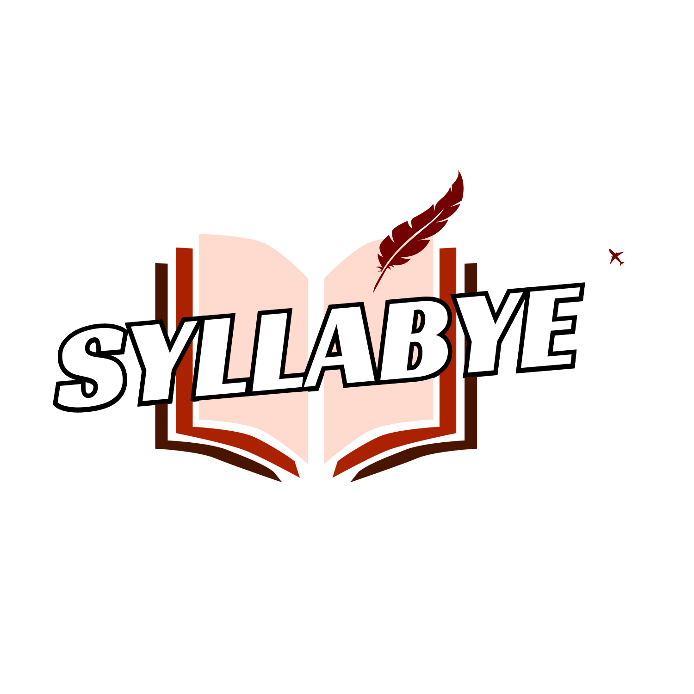

# Syllabye - Senior Capstone Project

 <!-- Add your logo here if available -->

Welcome to **Syllabye**, the ultimate solution for professors and students to streamline, simplify, and succeed in syllabus management! This project is the culmination of our senior capstone journey, where we’ve combined innovation, technology, and a dash of creativity to revolutionize how syllabi are created, edited, and shared.

---

## 🚀 **About the Project**

**Syllabye** is a web-based application designed to help professors easily create, edit, and manage their course syllabi. With features like dynamic customization, student-friendly views, and seamless export options, Syllabye makes syllabus management a breeze. Whether you're a professor looking to save time or a student seeking clarity, Syllabye has you covered.

### Key Features

- **Dynamic Syllabus Editor**: Drag-and-drop interface for easy syllabus creation.
- **Student-Friendly View**: Simplified, to-the-point version for students.
- **Export Options**: Save syllabi as PDFs or Word documents.
- **Collaboration Tools**: Real-time editing and feedback for professors and TAs.
- **Accessibility**: Built with inclusivity in mind, ensuring all users can access and use the platform.

---

## 👨‍💻 **Meet the Team**

We’re a team of passionate developers and problem-solvers from Lewis University, dedicated to making education more accessible and efficient. Here’s who we are:

| Team Member        | Role                          | Superpower                          |
|--------------------|-------------------------------|-------------------------------------|
| **Irving Sanchez**  | Project Manager               | Can debug code in his sleep.        |
| **Nick Krzysiak**   | Scrum Master                  | Makes databases sing.               |
| **Jaiden Leonard**  | Security Wizard               | Turns security into reality.        |
| **Bryan Avalos**    | Frontend Magician             | Knows every framework ever created. |

---

## 🛠️ **Tech Stack**

Here’s what powers Syllabye:

- **Frontend**: HTML, CSS, JavaScript, Bootstrap
- **Backend**: Node.js, Express.js
- **Database**: MongoDB
- **Version Control**: Git & GitHub
- **Deployment**: Azure
- **Icons**: Font Awesome
- **Other Tools**: Slick Carousel, jQuery

---

## 🚦 **Getting Started**

Ready to dive into **Syllabye**? Follow these steps to get the project up and running on your local machine.

git clone <https://github.com/ChairForce-1-0/Syllabye-Capstone.git>
cd Syllabye-Capstone
npm install
npm run dev

### **Prerequisites**

Before you begin, make sure you have the following installed:

- [Node.js](https://nodejs.org/) (v14 or higher)
- [npm](https://www.npmjs.com/) (comes with Node.js)
- [MongoDB](https://www.mongodb.com/) (local or cloud-based, like MongoDB Atlas)

More to come, updates coming soon....

## 📂 **Project Structure**

Here’s a quick overview of the project structure:
syllabye/

   ```bash
syllabye-app/
│── public/                 # Static assets (images, favicons)
│   ├── images/             # Logos and background images
│── src/                    # Main source code
│   ├── assets/             # CSS and global styles
│   ├── components/         # Reusable React components
│   ├── pages/              # Page-specific components
│   ├── App.jsx             # Main app component
│   ├── main.jsx            # React entry point
│── index.html              # Root HTML file
│── package.json            # Project dependencies & scripts
│── vite.config.js          # Vite configuration
│── README.md               # Project documentation


